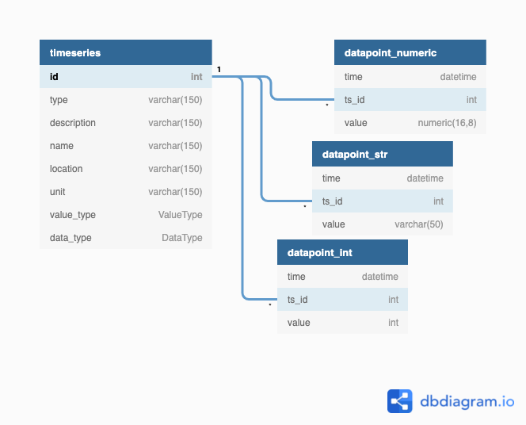

# Transformer timeseries-data
Minimum Viable Product for an on-prem prepopulated timescale db w mock sensor data

## Features
The MVP features include:
- Database optimized for timeseries
- Database web based admin panel
- Visualization using grafana dashboards

### Feature description 
- all physical devices or sensors are generalized to **timeseries** and associated timeseries **datapoints**
- A device/sensor measurements and kpi output value in combination with its timestamp, consists a single **datapoint**, i.e. a single datapoint is a combination of a value (int, str or float) and a timestamp corresponding to the time the value is valid for

## Core technologies (open source)
- Python
- SQLalchemy core expression language for database manipulation
- TimescaldeDB for the database
- Grafana for the visualization dashboards
- PGAdmin for database admin interface

## Technical implementation
### DB table overview

    --Enum legend--

    class ValueType:
        TEXT: int = 1
        INT: int = 2
        DECIMAL: int = 3
    class DataType:
        CONTINUOUS: int = 1  # typical sensor / device data
        DISCRETE: int = 2  # discrete or categorical data

## Design description
- src.script.main: main script.
- src.script.schemas: utility Enum definitions
- src.script.db: db tables, connection and utilities
- src.generate_testdata.py: create simulated timeseries and datapoints for test purposes
- grafana: prepopulated database / dashboard storage location **NOT IMPLEMENTED**

## Pre-requisites
1. First time use: create and populate .env file (use copy of env.py)
2. Dockerized services: docker-compose files contain service definitions for python data initialization script, grafana, pgadmin and timescale_db
   1. do "docker-compose -f docker-compose.yml up -d" to run a docker local timescale DB 
3. DB administration: Open database admin panel on localhost:9000 to investigate the DB admin panel, create a new connection to the server using the values supplied in .env file
4. Visualization: Open browser on localhost:3000, user admin and password admin, skip create new login, click on dashboard (based on test data)
   1. add datasource: go to Configuration/Data Sources - add data source - PostgreSQL
      1. populate host, database, user, password using the .env file provided data
      2. select SSL-mode disable
      3. select postgreSQL version 12
      4. select TimescaleDB
   2. add new visualizations / dashboards as wanted
   3. see example query below illustrating specific timescaleDB functionality

## Customization
- edit src.script.generate_testdata.py to create different timeseries 

## Testing
Removed

## Example Grafana dashboard query towards timescaleDB
- open browser to localhost:3000 (grafana) - user:pwd == admin:admin (skip new pwd)
  - add new data source: https://docs.timescale.com/timescaledb/latest/tutorials/grafana/create-dashboard-and-panel/#build-a-new-dashboard
  - create new dashboard:
  - create new panel: add new panel
  - in panel settings for query A: cleck Edit SQL: enter: 
  
      SELECT time_bucket('4 hours', ts) as time,
        avg(value) as avg_value
      FROM
        public.datapoint_numeric
      WHERE
        $__timeFilter(ts) and ts_id = 1
      GROUP BY 1
      ORDER BY 1
 - select time slice: Last 30 days
